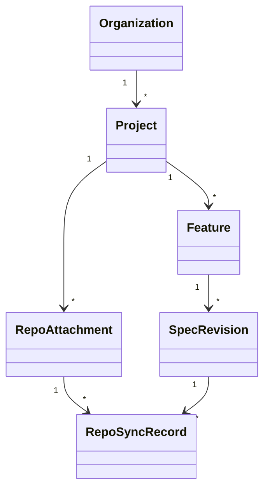
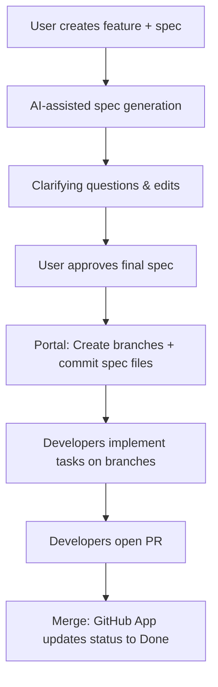
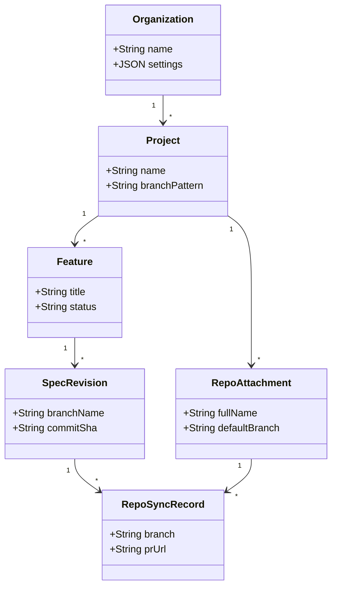

# Spec Forge: Implementation Blueprint (2026)

## Executive Summary  
Spec Forge is a planned **Next.js fullstack portal** that lets non-developers write and manage spec-driven requirements without needing a terminal. It will store spec files directly in GitHub (Markdown requirements, design, tasks) and track metadata in a lightweight SQLite database (via Prisma or Drizzle). Key features include multi-repo project support, BYOK model keys, an interactive AI-assisted spec editor with clarifying Q/A, and a handoff workflow for developers. We will integrate with GitHub via a GitHub App: creating branches, committing specs, and opening PRs using GitHub’s REST API【8†L598-L607】【16†L945-L954】. Security controls include encrypted key vaults (KMS), GitHub check runs for gatekeeping, and prompt sanitization【30†L1-L4】. This report covers feasibility, architecture details, data schemas, BYOK options, a phased roadmap with person-week estimates, resource and budget outlines, risk mitigations, testing strategy, and rollout plan. Primary sources include GitHub API docs, Copilot enterprise BYOK guidelines【5†L446-L455】, OpenCode ZEN BYOK docs【54†L397-L404】, and relevant SDD tool guides.

## Architecture and Technology Stack  
The entire backend will be implemented in Next.js (App Router) using **SQLite** (with an ORM like Prisma or Drizzle). Authentication is via GitHub OAuth; spec data is persisted in a local SQLite database. All business logic – including LLM calls and GitHub operations – runs in Next.js server components or API routes, so no separate services are needed. We leverage **Prisma/Drizzle** schemas to define the data model (see below) and generate migrations. 

**Key components:** Next.js pages (React UI), Next.js Server Actions/API routes (AI calls, GitHub App logic), SQLite DB, and the GitHub App. The **GitHub App** (registered in your GitHub account) has permissions to create refs, content, pull requests, and checks. It will use installation tokens for API calls. Webhook routes (e.g. `/api/github/webhook`) handle events like PR merges. All spec content files live in GitHub repos; the SQLite DB only tracks metadata (see Data Model).

This setup is fully feasible: GitHub’s REST API allows creating branches (`POST /repos/{owner}/{repo}/git/refs`)【8†L598-L607】, updating files (`PUT /repos/{owner}/{repo}/contents/{path}`)【46†L480-L489】, and opening PRs (`POST /repos/{owner}/{repo}/pulls`)【16†L945-L954】. We’ll use standard libraries (Octokit) in Node. The LLM gateway will call providers like OpenAI/Anthropic using their SDKs, with keys supplied by customers (BYOK). The MVP will skip complex features like MCP (unspecified requirement) and focus on the core Next.js/SQLite architecture.

## Data Model and SQLite Schema  
We store only minimal metadata in SQLite (not full spec text). The key tables are:

| **Entity**         | **Purpose**                                          | **Key Columns (SQLite)**                          |
|--------------------|------------------------------------------------------|---------------------------------------------------|
| **Organization**   | Customer workspace; holds BYOK config, templates.     | `id (PK)`, `name`, `settingsJSON`                  |
| **Project**        | Product area with 1+ repos and features.             | `id (PK)`, `orgId (FK)`, `name`, `branchPattern`   |
| **RepoAttachment** | Linked GitHub repo for a project.                    | `id (PK)`, `projectId (FK)`, `fullName`, `defaultBranch` |
| **Feature**        | A planned feature or work item.                      | `id (PK)`, `projectId (FK)`, `title`, `status`     |
| **SpecRevision**   | A version of a Feature’s spec (approved state).      | `id (PK)`, `featureId (FK)`, `branchName`, `commitSha`, `approvedBy`, `createdAt` |
| **RepoSyncRecord** | Tracks a spec rev in a repo (branch, PR URL).        | `id (PK)`, `specRevId (FK)`, `repoId (FK)`, `branch`, `prUrl`, `status` |
| **UserKey**        | (For BYOK) Stores encrypted API keys for users/orgs. | `id (PK)`, `ownerType`, `ownerId`, `provider`, `encryptedKey` |

Full specs are **not** stored in SQLite. Only `SpecRevision` references the branch where the spec files reside. The actual spec files (`requirements.md`, etc.) exist in GitHub. This keeps the DB small and portable.



In Next.js, we would define these tables in Prisma/Drizzle and generate migrations. For example, a simplified Prisma schema might include:
```prisma
model Project {
  id            Int    @id @default(autoincrement())
  name          String
  branchPattern String
  repoAttachments RepoAttachment[]
  features      Feature[]
}
```
and so on, linking to `RepoAttachment`, `Feature`, `SpecRevision`, `RepoSyncRecord` tables.

## BYOK and LLM Gateway Design  
Spec Forge supports **multiple LLM providers**. Users can bring keys for OpenAI (Codex) or Anthropic (Claude), among others. We must safely manage keys per enterprise. Key custody options:

| **BYOK Pattern**        | **Key Storage**                        | **Scope**            | **Example / Notes**                                           |
|-------------------------|----------------------------------------|----------------------|---------------------------------------------------------------|
| Organization-level      | Encrypted vault (server-side)          | Org-wide             | GitHub Copilot Enterprise: admin-entered keys for Anthropic/OpenAI【5†L446-L455】. OpenCode Zen: org workspace keys【54†L397-L404】. Keys not in DB plain. |
| Team/Workspace-scoped   | Team settings (gateway)                | Team or project      | Vercel AI Gateway: team-level API keys that apply to all projects【18†L1715-L1723】【18†L1727-L1734】. |
| User-specific (optional)| User profile (config file)             | Individual user      | OpenCode CLI (`/connect`), keys stored per user【32†L179-L182】. (Less controlled; not recommended for initial rollout.) |
| Self-hosted (private)   | Customer-managed in their infra        | Single-tenant deploy | Entire system on-prem; keys never leave network. Complies with strict policies. |
| Proxy/Request-overwrite | Request header forwarding (proxy)      | Granular requests    | e.g. adding `Authorization` header per call (LiteLLM style) to use different keys on the fly. |

Implementation: In Next.js server code, load keys from an encrypted env or secret store (e.g. AWS KMS). For BYOK we might use a Node library (or Prisma with encryption) to store encryptedKey in `UserKey`. When making LLM calls (e.g. in a Server Action), decrypt keys in-memory.

We also design an **LLM gateway layer**: essentially a thin adapter. For example:
```ts
async function callProvider(provider, prompt) {
  const key = decryptKey(userProvidedKey)
  if(provider === 'openai') return openai.chatCompletion(key, prompt)
  if(provider === 'anthropic') return anthropic.completion(key, prompt)
}
```
No LLM runs on the client. Optionally, a true proxy (like LiteLLM) could be used to encapsulate tokens. But initially, we directly call provider SDKs in Node.

### Prompt Injection & Security  
All user inputs and AI outputs must be sanitized. We treat all LLM results as untrusted (per NVIDIA recommendations)【30†L1-L4】. For example, if the AI returns a code snippet, we sanitize quotes/characters before writing to Git. We also use structured prompts (templates) to avoid code execution. Additionally, sensitive prompts (with business logic) are logged and encrypted in transit. Using an offline key store (KMS) and server-side-only calls adheres to best practices【30†L1-L4】.

### Compliance Controls  
We will likely need audit logging (who approved what, when). GitHub check runs (created by our GitHub App) can enforce policies: e.g. verify that spec files exist, or that certain labels are present before merge. Note: only GitHub Apps can create check runs【51†L298-L307】, so our app has that capability. We will implement a check that a merged PR contains an approved spec (by matching `SpecRevision`). This helps with compliance (e.g. an internal process says "no code merges without spec").

## Multi-Repo & Branch/PR Workflows  
Projects can attach multiple GitHub repos. When a spec is approved:

1. The portal creates a **dedicated branch** in each repo (same name, e.g. `spec/PRJ-123-feature-x`).
2. It commits the spec files (`requirements.md`, `design.md`, `tasks.md`) into each branch path (e.g. `/specs/feature-123/`).
3. It opens a pull request in each repo, linking back to the portal’s feature (optionally labeled “Spec: Feature X”).

Branch Naming: Deterministic and configurable. Examples:
```
pattern: spec/{projectKey}/{featureId}-{slug}
→ spec/PRJ/123-login-auth
pattern: feature/{key}/{id}/v{rev}
→ feature/SALES/456/v2
```
Recommended defaults: include project key and feature ID for uniqueness. A table of patterns:

| Pattern                      | Example                          | Notes                                 |
|------------------------------|----------------------------------|---------------------------------------|
| `spec/{proj}/{id}-{slug}`    | `spec/PRJ/123-add-login`         | Includes project, ID, slug.           |
| `feature/{projKey}/{feat}`   | `feature/ACME/321-payment`       | Flat pattern, easy read.              |
| `specs/{slug}/{id}`         | `specs/auth/789`                | Splits slug into folder if needed.    |

These cover most use cases. Branches are created via `POST /git/refs`【8†L598-L607】 and commits made via the Content API【46†L480-L489】. After pushing, we record the branch name and head SHA in `SpecRevision`/`RepoSyncRecord`.

**Freeze-on-Handoff Policy:** Once a spec revision is handed off (i.e. committed to branches and PRs opened), that spec is considered immutable. Any further edits require a *new SpecRevision* (new branch name, e.g. bump a rev suffix). This ensures code merges are always against a reviewed spec. We enforce this by locking the approved `SpecRevision` record (no more edits to it) and requiring a new revision for changes. Developers will always see the locked spec in the branch – they cannot modify the old spec files without versioning.

```mermaid
flowchart TD
    A[Business drafts spec (AI-assisted)] --> B[Review & approve spec]
    B --> C[Portal creates branch(es) and commits spec]
    C --> D[Developers implement & open PR]
    D --> E[Merge triggers webhook → mark Done]
```

## Clarifying-Question Loop & UX  
The UI centers on a spec editor with three sections (requirements, design, tasks). A user can optionally press **“Generate Spec”** to invoke AI (using their BYOK key) to draft initial content. After generation, the UI presents **clarifying questions** for each section: these can be multiple-choice or free-text prompts. For example, the system might ask “Should error case X be handled?” with Yes/No options. User responses are fed back into the model to refine the spec. All Q&A is logged in a sidebar for traceability.

Key UX elements:
- **Markdown Editor:** Each section is a text area. We show a diff viewer (like GitHub) whenever a revision is made.
- **Templates/Prompts:** Default spec templates guide structure (based on examples from Spec Kit/OpenSpec). Administrators can customize these templates per project (stored in SQLite or flat files).
- **Dashboards:** Project overview lists features, statuses (Draft, Approved, In Progress, Done). Filters for urgent or blocked items. 
- **Notifications:** On final approval, developers (GitHub team or individuals) are notified via assigned PRs or chat integration.

Importantly, **business users never see the terminal**. They author specs purely in this browser portal. Developers later use their usual tools (IDE/CLI) on the created branches. Spec Forge only needs to ensure spec artifacts are in Git for them to pick up.

## Branch/PR API Examples  
*(Using GitHub REST API v2026-03-10)*

**Create a new branch:**
```http
POST /repos/{owner}/{repo}/git/refs
Content-Type: application/json
Authorization: Bearer <App-Token>

{
  "ref": "refs/heads/spec/PRJ/123-feature",
  "sha": "abcdef1234567890"  // base commit SHA (e.g. main)
}
```
【8†L598-L607】

**Commit spec file (e.g. requirements.md):**
```http
PUT /repos/{owner}/{repo}/contents/specs/feature-123/requirements.md
Content-Type: application/json
Authorization: Bearer <App-Token>

{
  "message": "Add requirements for Feature 123",
  "content": "<base64-of-markdown>",
  "branch": "spec/PRJ/123-feature"
}
```
【46†L480-L489】

**Open a pull request:**
```http
POST /repos/{owner}/{repo}/pulls
Content-Type: application/json
Authorization: Bearer <App-Token>

{
  "title": "Feature 123: Implement login",
  "head": "spec/PRJ/123-feature",
  "base": "main",
  "body": "This PR contains the spec for Feature 123."
}
```
【16†L945-L954】

These sequences will be implemented in Next.js API routes (server actions) using Octokit.

## Security & Compliance Controls  
- **GitHub Checks:** The GitHub App will create a *Check Run* (via `POST /repos/{owner}/{repo}/check-runs`) to enforce that a spec is present before merge【51†L298-L307】. If the spec files are missing or outdated, the check fails. This leverages GitHub’s Checks API (requires GitHub App).
- **Access Control:** Only authenticated users (GitHub SSO) can access the portal. We will map GitHub org/team membership to app roles (e.g. only certain teams can approve specs).
- **Key Security:** API keys are encrypted at rest. We never send keys to the client. When calling LLMs, we include a user’s key in the Authorization header to the provider, ensuring BYOK usage【54†L397-L404】.
- **Prompt Safeguards:** Prompts and responses are run through sanitizers. For example, we strip any `$(...)` or backtick code injection attempts from user answers. Model outputs are sanitized before committing (no inline HTML, for instance).
- **Audit Trail:** Actions (spec approvals, PR merges) are logged with timestamps and user IDs. We may periodically export audit logs for compliance review.
- **Data Residency:** If deployed on-premises (self-hosted option), all data stays within the org’s network. BYOK on-prem ensures no data leaks to third-party AI providers outside approved keys.
- **Policy Compliance:** Users are reminded not to paste proprietary code into AI prompts (some providers discourage this). We also implement an “I agree” step before using BYOK keys to ensure compliance with provider TOS.

## Phased MVP Roadmap  

1. **MVP Core (2 weeks)**: Set up Next.js + SQLite. Implement user login (GitHub OAuth) and GitHub App authentication. Build UI: project creation, link repos. Hardcode spec sections. Implement “Create branch” + “Commit empty files” on spec approval.  
   - *Deliverables:* Basic portal, branch creation tested, DB tables.  
   - *Effort:* 4 dev-weeks (1 fullstack, 1 part-time product).  

2. **AI-Assisted Drafting (3 weeks)**: Integrate Codex (OpenAI) for draft spec generation. UI button “Generate Spec” fills sections. Implement clarifying Q/A form. On approval, use GitHub API to commit real markdown content to branches.  
   - *Deliverables:* Working AI spec draft and refine flow.  
   - *Effort:* 6 dev-weeks (2 fullstack).  

3. **Multi-Repo & BYOK (4 weeks)**: Support linking multiple repos per project. Ensure branches created in all repos. Add settings for BYOK keys (encrypted). Use Prisma schema migrations for adding keys table. Integrate LLM calls using stored keys.  
   - *Deliverables:* Multi-repo sync, BYOK key entry.  
   - *Effort:* 8 dev-weeks (2 fullstack).  

4. **Workflow & Security (4 weeks)**: Implement PR creation in each repo. Handle webhooks: on PR merge, mark feature done. Add GitHub Check Runs to block merges without approved spec. Freeze specs post-approval. Improve UI (diff view, dashboards).  
   - *Deliverables:* End-to-end workflow with gatekeeping.  
   - *Effort:* 8 dev-weeks (2 fullstack, 1 QA part-time).  

5. **Testing & Polish (3 weeks)**: Write automated tests (unit, integration). Perform security audit. Prepare deployment (Docker). Create documentation and training slides. Conduct internal UAT.  
   - *Deliverables:* Test suite, docs, internal training.  
   - *Effort:* 5 dev-weeks (1 fullstack, 1 QA, 1 tech-writer).  

All timelines are approximate. Each phase ends with a review: e.g., a pilot with a product team for UAT. We use Agile sprints to refine requirements continuously.

## Resource Plan and Budget  
**Team Roles:** Full-stack engineers (Next.js/Node) with Git/GitHub expertise, a DevOps/Security engineer, a product manager, and a QA tester. Example allocation: 2 engineers, 0.5 QA, 0.5 PM.

**Headcount & Skills:** 
- 2× Developers: JavaScript, Next.js, Prisma/Drizzle, GitHub Apps.
- 0.5× QA: test automation, security testing.
- 0.5× PM/BA: requirement gathering, user feedback, documentation.

**Budget (High/Med/Low):**  
- *Cloud SaaS Deployment:* **Medium**. Costs: cloud VM for Next.js, managed SQLite storage (negligible), orchestration (e.g. Vercel/Netlify), and incidental (monitoring, security scans). Ongoing costs for LLM usage via BYOK.  
- *Self-hosted:* **High**. Requires on-prem server setup, maintenance, on-prem LLM gateway (if needed), and possibly higher compliance costs. For deep security (e.g. FedRAMP) budget may be higher.  

(Exact numbers depend on region/infrastructure choices and scale. But self-hosting roughly multiplies the cloud costs by 2–3× for infrastructure and personnel overhead.)

## BYOK Comparison

| **Pattern**          | **Storage**          | **Scope**            | **Provider Support**  | **Notes**                                    |
|----------------------|----------------------|----------------------|-----------------------|----------------------------------------------|
| **Org-level**        | Vault/KMS (server)   | All users in org     | Major (OpenAI, Anthropic) | Keys reused by all; costs billed to prov. 【54†L397-L404】|
| **Team/Workspace**   | Gateway settings     | Specific team        | Depends on gateway    | e.g. Vercel AI Gateway【18†L1715-L1723】. Single point to update keys. |
| **User-level**       | Encrypted DB/User    | Individual           | Any                  | Fits BYOC (bring your own *consumer* account). Lower control. |
| **Self-hosted**      | Customer infra vault | Entire deployment    | Any (within network) | Meets strict compliance; no external deps.  |
| **Request-Proxy**    | Ephemeral (header)   | Per-call            | Any                  | Like LiteLLM: forward key per call; high flexibility. |

## Branch Naming Templates

| **Template**                        | **Example**                   | **Description**                    |
|-------------------------------------|-------------------------------|------------------------------------|
| `spec/{projKey}/{id}-{slug}`       | `spec/SALES/1234-add-login`   | Clear grouping by project key.     |
| `feature/{projKey}/{id}/v{rev}`    | `feature/MKTG/567/v2`         | Includes revision number.          |
| `specs/{slug}/{id}`               | `specs/auth/789`             | Folder by slug.                    |

These are configurable per project. We recommend including both project key and feature ID for uniqueness, plus an optional revision suffix for iterative edits.

## Mermaid Diagrams  





## Risk Register  

| **Risk**                        | **Likelihood** | **Impact** | **Mitigation**                                 | **Acceptance Criteria**                                      |
|---------------------------------|----------------|------------|------------------------------------------------|--------------------------------------------------------------|
| API Rate Limits                 | Medium         | High       | Batch GitHub calls; backoff retries.           | All operations succeed under realistic load.                |
| Key Leak / Compromise           | Low            | Critical   | Encrypted store; no key in frontend; audits.   | Pen-test finds no leakage; encryption verified.            |
| Prompt Injection                | Medium         | High       | Input sanitization; user review of AI output.  | All AI suggestions are vetted by user before commit.       |
| Spec Drift (unapproved edits)   | Low            | Medium     | Freeze specs on approval; require new revision.| No code merged with outdated specs; automated check-runs pass. |
| Complexity Overrun              | Medium         | Medium     | MVP focus; avoid premature optimization.       | MVP delivered on schedule with core features only.         |

Each risk’s mitigation has clear acceptance criteria. For example, **Spec Drift** is mitigated by locking revisions; we accept the risk when our Check Run prevents any PR merge missing a spec file【51†L298-L307】.

## Testing Plan  

- **Unit Tests:** Mock Next.js server actions and GitHub calls. Test spec generation logic, DB interactions, and utility functions. Aim for ≥80% coverage.  
- **Integration Tests:** End-to-end tests using a test GitHub repository. Simulate the full flow: login, create spec, push branches, merge PR, check status updates.  
- **Security Tests:** Static code analysis (lint and SAST). Penetration test focusing on web inputs (XSS, injection) and secret management. Verify encryption of BYOK keys.  
- **Compliance Checks:** Ensure BYOK workflow aligns with provider terms. Code review for logging sensitive info. GDPR/CCPA review if needed.  
- **User Acceptance Testing (UAT):** Run a pilot with real product team. Collect feedback on UX (clarity, ease) and agent accuracy. Adjust before full launch.

## Rollout and Adoption Plan  

- **Pilot (Month +1):** Roll out to one team (5–10 users). Provide a brief training demo. Monitor usage and issues.  
- **Training:** Create short video/tutorial. Conduct workshops (1hr session) to onboard product managers and dev leads.  
- **Metrics/KPIs:** Track # of features created, average spec creation time, dev acceptance rate of specs, and user satisfaction (surveys). Aim to reduce spec-to-code cycle time by 30%.  
- **Gradual Rollout:** After pilot tweaks, expand to other teams. Offer office-hours support.  
- **Feedback Loop:** Maintain a channel for feature requests and bug reports. Iterate based on adoption metrics.

With this comprehensive plan and architecture, Spec Forge can be built to satisfy enterprise requirements using standard tools, with citations guiding our design choices【8†L598-L607】【16†L945-L954】【5†L446-L455】【54†L397-L404】.

