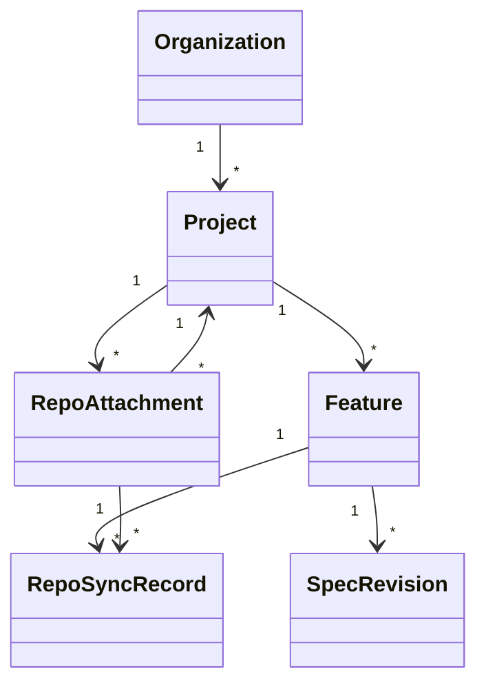

# Spec Forge: Implementation Plan (2026)  

## Executive Summary  
Spec Forge is a proposed **Next.js web portal** for spec-driven development (SDD) that empowers product and business teams to write requirements without touching an IDE or CLI. It will generate structured specs (requirements, design, tasks), support interactive AI-assisted editing, and then synchronize those specs into GitHub repositories via a GitHub App. Key features include multi-repo project support, configurable branch naming, and a clarifying-question review loop. We will emphasize **BYOK (Bring Your Own Key)** for AI models (e.g. customers supply their OpenAI/Anthropic keys), secure key management (encrypted vaults, KMS), and compliance. The portal will integrate with GitHub Copilot, OpenCode (Codex), and Claude Code workflows, with an optional MCP server for developer context. This report covers feasibility, detailed architecture, data models, security, a phased roadmap with milestones/effort estimates, resource and budget considerations, risk mitigations, testing strategy, and rollout plan. All technical choices leverage existing APIs and best practices (e.g. GitHub REST API for branch/PR creation, Copilot BYOK support, OpenCode/ZEN BYOK, and LLM key security guidelines).

## System Architecture Overview  
Spec Forge has three main layers: **Frontend (Next.js UI)**, **Backend/Orchestrator**, and **GitHub Integration (App/Webhooks)**. The UI allows users to create projects, define features, and author specs using markdown editors and AI prompts. The backend handles template rendering and LLM calls via an AI gateway (with BYOK keys stored securely). The GitHub App component executes repository actions: creating branches, committing spec files, opening pull requests, and listening to webhooks. This design is feasible because GitHub’s REST API fully supports all required operations (e.g. creating a branch with `POST /git/refs`, updating files with `PUT /repos/.../contents/...`, and creating PRs with `POST /pulls`). The portal will maintain a backend data model (see below) to track Projects, Features, SpecRevisions, and their links to repo branches. A mermaid flowchart outlines the end-to-end workflow:

```mermaid
flowchart LR
  A[Create Project & Feature] --> B[AI-assisted Spec Drafting]
  B --> C[Clarifying Q/A Loop (UI)]
  C --> D[Approve Final Spec]
  D --> E[GitHub App: Create Branch & Commit Spec]
  E --> F[Developers Implement (Copilot/Claude)]
  F --> G[Open PR & Merge]
  G --> H[Portal marks Feature Done]
```

In summary, the architecture leverages existing tools: LLM providers (through configurable APIs), secure data storage, Next.js for frontend, and GitHub Apps for repo automation. All complex logic (e.g. prompt chaining, key usage) happens on the server side, ensuring business users never handle CLI or keys.

## Data Model and Git Workflows  
The portal’s data model will include (see table):

| **Entity**         | **Description**                                        | **Key Fields**                    |
|--------------------|--------------------------------------------------------|-----------------------------------|
| **Organization**   | Customer workspace; stores BYOK config, templates.     | `id, name, authConfig, members`   |
| **Project**        | Group of repos/features.                               | `id, name, key, repoIds, branchPattern` |
| **RepoAttachment** | Links a GitHub repo to a project.                      | `id, projectId, repoFullName, defaultBranch` |
| **Feature**        | A work item spanning one or more repos.                | `id, projectId, title, status`    |
| **SpecRevision**   | A specific version of a feature’s spec.                | `id, featureId, revNumber, content, approvedBy` |
| **RepoSyncRecord** | Tracks a spec’s placement in a repo (branch, commit).  | `id, specRevId, repoId, branch, commitSha, prUrl` |



**Branch Naming:** We will use deterministic branch names to sync specs across repos. Configurable templates might be like `feature/{proj}/{id}-{slug}`, e.g. `feature/SHOP/1234-add-login`, or including revision `r{rev}`. Example patterns:

| Pattern                      | Example                           | Note                                  |
|------------------------------|-----------------------------------|---------------------------------------|
| `feature/{proj}/{id}-{slug}` | `feature/SHOP/1234-add-login`      | Simple flat naming.                   |
| `specforge/{proj}/{feat}-r{rev}` | `specforge/ACME/321-payment-r2` | Prefix and rev.                       |
| `specs/{slug}-{id}`          | `specs/auth-101`                  | Short prefix only.                    |

These ensure uniqueness and ease of lookup. When a spec is approved, the portal uses the GitHub REST API to:
- **Create branch:** `POST /repos/{owner}/{repo}/git/refs` with `{"ref":"refs/heads/<branch>","sha":"<baseCommit>"}`.
- **Commit spec files:** For each file (`requirements.md`, `design.md`, `tasks.md`), use `PUT /repos/{owner}/{repo}/contents/{path}` with a JSON body including base64-encoded content, commit message, and branch.
- **Open PR:** `POST /repos/{owner}/{repo}/pulls` with `head=<branch>&base=<defaultBranch>&title=<...>`. The PR can serve as a handover artifact or be optional if direct merge is preferred.

Once developers finish implementation, their merges back to the default branch trigger the portal via GitHub webhook. Each merged commit is recorded in `RepoSyncRecord`, letting the portal mark the Feature as **Done**.

## BYOK and LLM Gateway Design  
Spec Forge will support multiple LLM providers. An administrative UI will allow entering API keys for supported providers (OpenAI, Anthropic, Google AI, etc.). Keys are stored encrypted (e.g. AWS KMS or Vault) and only used in server-side calls. We consider these BYOK custody models:

| BYOK Pattern        | Key Custodian               | Scope/Use-case                    | Examples/Notes                                           |
|---------------------|-----------------------------|-----------------------------------|---------------------------------------------------------|
| **Organization-level** | Org Admin (secret store)  | Enterprise-wide (all team members) | GitHub Copilot Enterprise: admins register custom model keys (Anthropic, OpenAI, etc.). OpenCode Zen: admins can invite members and share org keys. Billing to provider. |
| **Team/Workspace**    | Team (gateway service)    | Specific team or group           | Vercel AI Gateway: team-scoped API keys used by all projects. If user key fails, can fallback to system key. |
| **User-level**        | Individual (client config) | Single-user or small team        | OpenCode CLI: each developer runs `/connect` and keys go in `~/.local/share/opencode/auth.json`. (Flexibile but riskier.) |
| **Self-hosted**      | Customer infra (private)   | Dedicated on-prem or VPC         | Organization hosts entire system; keys never leave network. Aligns with provider best practices. |
| **Proxy/Request**    | API Gateway (header)       | Per-request overrides           | Example: use a middleware that forwards an `Authorization` header with provider key for each request (like LiteLLM’s header-forwarding). Enables mixing keys per call. |

The chosen approach for MVP will likely be **Organization-level** (backend-managed keys per org) combined with a **gateway pattern**. For instance, we may integrate Vercel's AI Gateway concept: save keys under a team and route all LLM calls through that gateway with no modifications to the content. Keys are never exposed in browser. User-level BYOK (developers entering their own keys) can be added later if needed, but initial rollout will assume admin-provided keys. All LLM API calls use HTTPS with the official libraries/SDKs. 

We will also enforce **Prompt Sanitization and Guardrails**: treat all LLM outputs as untrusted, stripping or escaping dangerous patterns. For example, AI-generated code snippets or URLs will be validated server-side before use. This aligns with NVIDIA's guidance to sanitize all model outputs. We also will **log all prompts and responses** for audit/compliance.

## Multi-Repo and Branch/PR Workflow  
Spec Forge handles projects with multiple GitHub repos. Each project has attached Repo records. When a spec is approved, the GitHub App will:
- Create the **same branch name** in each attached repo (based on the branch naming pattern).
- Commit the spec artifacts under a known directory (e.g. `specs/feature-{ID}/`) in each branch.
- Optionally open parallel PRs in each repo against their default branches. Each PR’s URL is recorded in `RepoSyncRecord`. 

This multi-repo strategy means a feature spanning N repos will have N branches. Developers then implement tasks in their respective repos. Because branches share an identifier, the portal can aggregate status (e.g. “all PRs merged” = feature complete). 

We enforce a **freeze-on-handoff** policy: once a spec is handed off (committed and possibly PR-opened), it is locked. Business users cannot alter that spec revision; any changes require creating a new revision (with a new branch, e.g. bumping `r{rev}`). This prevents drift and merge conflicts. We may also implement a **GitHub Check Run** on merge that verifies the spec content hasn’t been tampered with (since check runs require a GitHub App, this is naturally satisfied by our architecture).

## Clarifying Question Loop & UX  
To guide users, Spec Forge implements an **iterative Q&A flow**. After an initial draft, the system presents clarified questions (e.g. Yes/No or multiple-choice) to resolve ambiguities. The UI will show questions one at a time (or in groups), with radio buttons, checkboxes, or text fields. Each answer modifies the spec by re-running the AI model with the additional context. All questions and responses are timestamped and shown in a sidebar (audit log).

Key UX components:
- **Spec Editor:** A markdown editor with section templates (requirements.md, design.md, tasks.md). Placeholders and help text appear for each section.
- **Template Packs:** Administrators can define or import template sets. By default, use patterns inspired by tools like Spec Kit and Kiro (breaking down what/how/tasks).
- **Review Diffs:** Every time a spec revision is created, users see a diff view (using GitHub-like UI) comparing it to the previous version.
- **Status Dashboard:** Projects page listing features and their current status, plus metrics (e.g. number of open specs). Notifications can be emailed or posted to Slack on key events.

Developers need minimal onboarding: they simply pull the branch, and their agent (Copilot Chat, Claude Code, etc.) can read the spec from the repo. Because spec files are in Git, all standard GitOps practices (code reviews, pipelines) still apply.

## Security, Compliance, and Policies  
Security and governance are paramount:

- **RBAC & Approval Workflow:** Only authorized users (e.g. via SSO groups) can create or approve specs. Actions are audited.
- **Key Management:** API keys are stored encrypted (e.g. in KMS). Only the backend decrypts them at runtime. Per OpenAI guidance, keys are never placed in client JS.
- **Compliance Checks:** We treat all AI data flows as controlled. If needed, integration with security scanning (e.g. SAST on generated code) can be added. 
- **Prompt Injection Mitigations:** We parameterize prompts to avoid untrusted content insertion. For example, user answers to clarifying questions are sanitized and not used to execute any hidden commands. All AI responses are validated.
- **Check Runs:** Using the Checks API (via GitHub App) to enforce policies. For example, a check run could reject merges if the feature’s `requirements.md` is missing or not approved. As noted, only GitHub Apps can create check runs, so our architecture naturally enables this.
- **Third-Party Review:** Since models are involved, we will document the model usage (e.g. which model produced what). We can allow clients to disable certain models (as OpenCode does) for data governance.
- **Network Security:** If self-hosted, all network calls (LLM APIs, GitHub API) use TLS and adhere to corporate network policies. Infrastructure secrets are rotated regularly.

Any deviation (e.g. someone tries to write a malicious prompt) is caught by validating all outputs and by requiring an explicit approval step.

## Project Roadmap and Milestones  
We propose a phased agile development plan. Estimated effort is rough and assumes a small team. Milestone sign-offs and deliverables are defined for each phase.

1. **MVP Phase (0–2 months):**  
   - Deliverables: Core portal setup, GitHub App integration, basic UI (project/feature creation, markdown editor), branch creation and spec commit (hardcoded templates).  
   - Key tasks: Set up Next.js framework, authenticate with GitHub, implement GitHub App to create a branch and commit two files using GitHub API (Refs API for branch, Contents API for files). Open a PR.  
   - *Effort:* 4 developer-weeks (1 front-end, 1 back-end).  
   - *Acceptance Criteria:* Successful spec creation in UI, branch and PR appear in GitHub with stub content.

2. **AI Assist Phase (2–4 months):**  
   - Deliverables: LLM gateway integration, interactive drafting.  
   - Key tasks: Implement backend calls to an LLM (start with one provider). Create prompts for spec drafting and clarifying questions. Store and display answers. Update spec content based on responses.  
   - *Effort:* 6 dev-weeks (1 dev focusing on LLM integration, 1 on UI enhancements).  
   - *Acceptance:* Users can click “Generate spec” and see auto-filled content, then refine via Q/A before committing.

3. **Multi-Repo & BYOK Phase (4–7 months):**  
   - Deliverables: Support for multiple repos, configurable branch names, BYOK key management.  
   - Key tasks: Add RepoAttachment model/UI, iterate branch creation over all repos. Add settings pages for organization/model keys (encrypted storage).  
   - *Effort:* 8 dev-weeks (1 back-end, 1 full-stack).  
   - *Acceptance:* An approved spec spawns branches in all linked repos with content; LLM calls use user-provided keys from vault.

4. **Security & Workflow Phase (7–10 months):**  
   - Deliverables: Check runs, workflow locking, audit logging, MVP refined.  
   - Key tasks: Implement GitHub webhooks for PR merges, mark features Done. Create check runs in the App to enforce spec presence. Add unit tests and logging for all critical operations. Freeze specs on approval.  
   - *Effort:* 6 dev-weeks (1 back-end, 1 QA/test).  
   - *Acceptance:* Merges on implementation PRs update portal status; merges without spec fail a check run. Spec after approval cannot be edited without creating a new revision.

5. **Polish & Deployment (10–12 months):**  
   - Deliverables: Final UI polish (diff view, dashboards), deployment scripts (Docker/K8s or SaaS), documentation, training materials.  
   - Key tasks: Implement markdown diff view, notifications, metrics dashboard. Set up CI/CD pipeline. Prepare user guide and admin manual.  
   - *Effort:* 4 dev-weeks + 2 doc-weeks.  
   - *Acceptance:* System deployed (or ready for SaaS), internal pilot completed with sample teams, documentation published.

## Resource Plan and Budget  

**Team Roles:** We estimate ~2–3 full-time engineers and 1 part-time QA:

- **Frontend Engineer (1)** – Experienced in React/Next.js. Implements UI (editors, forms, dashboards).  
- **Backend Engineer (1–2)** – Node.js or similar to handle API calls, LLM integration, GitHub App logic. Familiar with security/best practices.  
- **QA/Tester (0.5)** – Validates integration, builds test suite (unit, integration, security).  
- **Project Manager/Analyst (0.5)** – Oversees requirements, user acceptance tests, training prep.  

**Skills Needed:** JavaScript/TypeScript, React, Node.js, experience with GitHub APIs/GitHub Apps (Octokit or Probot), knowledge of LLM APIs (OpenAI/Anthropic), cloud deployment (AWS/Azure). DevOps experience for secure key management. Familiarity with compliance.

**Budget (SaaS vs Self-hosted):**  

- *SaaS (cloud-hosted)*: Lower upfront infra costs. Budget Estimate: **Medium**. Costs for cloud servers, managed secrets (KMS), paid LLM usage (assume BYOK keys billed to customer).  
- *Self-hosted (on-prem)*: Higher up-front (hardware, deployment), but may satisfy data residency. Budget Estimate: **High**. Includes corporate infrastructure, licensing (if any), internal security audits.  

A rough relative scale: SaaS could be on the order of tens of thousands USD/year (server + services), whereas a full on-prem deployment including staff could be 2–3× higher, especially accounting for stricter security reviews.

## Risk Register  

| **Risk**                                 | **Likelihood** | **Impact**    | **Mitigation**                                       | **Acceptance Criteria**                                      |
|------------------------------------------|----------------|---------------|------------------------------------------------------|--------------------------------------------------------------|
| **Key Leakage** (BYOK keys exposed)      | Medium         | Critical      | Encrypt keys, server-side only, rotate keys. Limit UI access. | No keys appear in logs or frontend; pass security review.    |
| **LLM Hallucinations** (wrong spec output)| Medium         | High          | Keep human in loop (approval required). Sanitize output. | Any AI-generated content is reviewed by user before use.    |
| **Merge Conflicts** (multiple repos)     | Low            | Medium        | Use deterministic branch naming. Freeze spec post-approval. | No branch name collisions; all merges succeed.              |
| **Insufficient API Scopes** (GitHub App) | Low            | High          | Grant only needed permissions (contents, checks). Monitor logs. | GitHub actions succeed; no permission error.                |
| **Adoption Resistance** (users won’t use) | Medium         | Medium        | Involve stakeholders early. Provide training.        | Pilot users report easier workflow vs alternatives.         |
| **BYOK Policy Violation** (shared keys disallowed) | Low   | High          | Educate users on key policies. Support token-based auth (if needed). | Legal/DevOps approve BYOK approach.                         |
| **Vendor Lock-in** (relying on Copilot/Specific LLM) | Low   | Medium        | Design agnostic spec formats; support multiple providers. | System works if Copilot disabled; models can be swapped.   |

Each risk’s mitigation aligns with acceptance criteria. E.g., **merge conflicts** are mitigated by branch strategy and spec freezing. We will formally accept this risk if all pilot merges proceed without conflict.

## Testing and Validation Plan  
- **Unit Tests:** For backend logic (GitHub API calls mocked, prompt handling). At least 70% coverage on core modules (branch creation, file update, permission checks).  
- **Integration Tests:** Spin up a test GitHub organization (or use GitHub Enterprise test environment) and run end-to-end flows: create project, author spec, commit to GitHub, merge code, webhook triggers. Use test LLM endpoints (e.g. nully or synthetic responses) to validate handling.  
- **Security Tests:** Perform threat modeling. Code review for injection vectors. Use static analysis tools (e.g. SonarQube) on code. Test key storage with penetration tools to confirm encryption is effective.  
- **Performance Tests:** Load test GitHub API rate limits. Ensure LLM calls scale with usage (possibly queue requests if needed).  
- **Compliance Tests:** If applicable, check GDPR or data residency by verifying no user data leaves region (for self-hosted cases). Ensure audit logs capture all actions.  
- **User Acceptance Tests (UAT):** Engage a sample of business users (PMs/BAs) to try the portal. Gather feedback on UI clarity, spec templates, and overall satisfaction. Incorporate fixes.  
Metrics for success include reduced time to translate feature requests into tech tasks, and developer satisfaction with spec clarity.

## Rollout and Adoption Plan  
- **Pilot (Month 12):** Deploy Spec Forge to one product team. Conduct 1–2 week pilot on real feature. Gather feedback and fix issues.  
- **Training:** Develop quickstart guides, host webinars for end-users. Show how to write specs, how QA loop works. Emphasize BYOK usage (e.g. “Add your OpenAI key here”).  
- **Metrics/KPIs:** Measure adoption by counting monthly active users and number of features created. Track cycle time from spec creation to code merge (should decrease). Monitor GitHub PR metrics (e.g. spec acceptance rate).  
- **Full Rollout:** Based on pilot, refine the product and expand to all teams. Provide support channels (Slack, documentation).  
- **Feedback Loop:** Maintain backlog of enhancements (additional agents, custom templates) based on usage. Continue to monitor performance and costs.  

This plan balances thoroughness with agility. By iterating in phases and validating each capability (e.g. key security, multi-repo sync) before expanding, we ensure a reliable production system. All critical integrations (GitHub REST endpoints, BYOK mechanisms) rely on documented APIs, which de-risks the implementation. The proposed team and timeline are estimates; actual person-weeks may adjust with complexity. 

